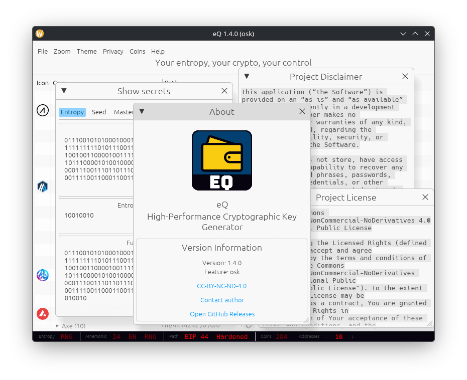
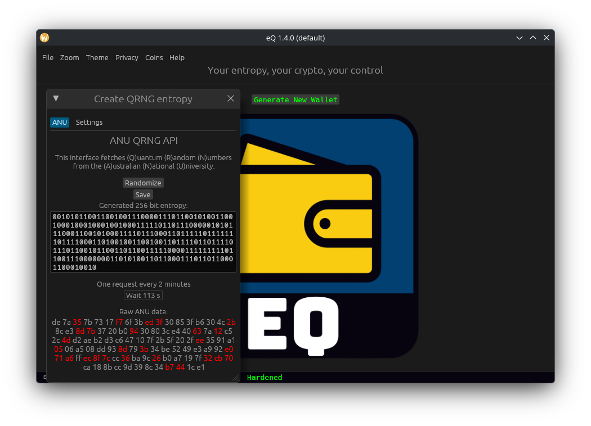
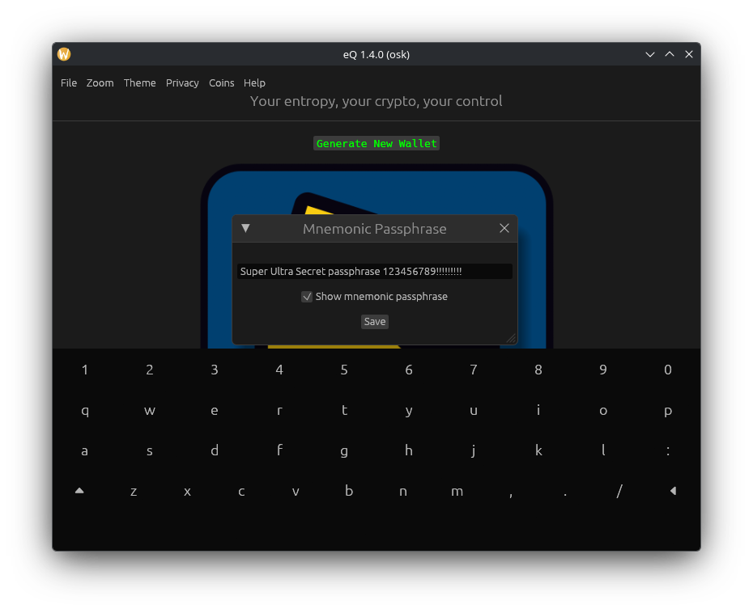

# eQ: High-Performance Cryptographic Key Generator

## Disclaimer

> Read the [DISCLAIMER](./doc/disclaimer.md) file.


## Info

```
 ▄▄▄▄▄▄▄▄▄▄▄   ▄▄▄▄▄▄▄▄▄▄▄ 
█░░░░░░░░░░░█ █░░░░░░░░░░░█
█░█▀▀▀▀▀▀▀▀▀  █░█▀▀▀▀▀▀▀█░█
█░█           █░█       █░█
█░█▄▄▄▄▄▄▄▄▄  █░█       █░█
█░░░░░░░░░░░█ █░█       █░█
█░█▀▀▀▀▀▀▀▀▀  █░█▄▄▄▄▄▄▄█░█
█░█           █░░░░░░░░░░░█
█░█▄▄▄▄▄▄▄▄▄  ▀▀▀▀▀▀█░█▀▀ 
█░░░░░░░░░░░█        █░█  
 ▀▀▀▀▀▀▀▀▀▀▀          ▀   
CC-BY-NC-ND-4.0
Control Owl [2023-2026]
```

**eQ** is a **high-performance, security-focused cryptographic key generator** built with **Rust** and **egui**. It provides fast, deterministic, and zero-dependency key generation for **293 cryptocurrencies**, with optional **quantum-grade entropy** sourced from the **Australian National University (ANU) Quantum Random Number Generator**.

This is the second generation of our key generator, following [QR2M](https://github.com/control-owl/QR2M).

---

## Key Highlights

### **Quantum-grade entropy (QRNG)**

eQ can source entropy from the **ANU Quantum Random Numbers Server**, which generates randomness from **vacuum fluctuations measured via quantum optics** - a fundamentally unpredictable physical process.

- Official ANU QRNG service: [https://qrng.anu.edu.au](https://qrng.anu.edu.au)
- API documentation: [https://qrng.anu.edu.au/contact/api-documentation/](https://qrng.anu.edu.au/contact/api-documentation/)

This provides an additional entropy option beyond system RNGs, especially valuable for users who want **verifiable, physics-based randomness** rather than algorithmic PRNG output.

### **Security-first design**

- Full **zeroization** of sensitive data
- Wallets stored as **AES-256-GCM encrypted SVG images**
- Optional **Shamir’s Secret Sharing** for multi-share wallet splitting
- No external dependencies during key generation (offline-capable)
- For extra security, an offline air-gapped version was created: [eQ-OS](https://github.com/control-owl/eQ-OS)

### **Cross-platform and fast**

- Native builds for **Windows**, **Linux**, and **macOS**
- Rust-powered performance
- Minimalistic, predictable UI built with **egui**

---

## Table of Contents

- [Disclaimer](#disclaimer)
- [Info](#info)
- [Key Highlights](#key-highlights)
- [License](#license)
- [Project Status](#project-status)
- [Features](#features)
- [Installation](#installation)
- [Screenshots](#screenshots)
- [Donations](#donations)
- [Third-Party Libraries](#third-party-libraries)

---

## License

This project is licensed under a **Creative Commons Attribution Non Commercial No Derivatives 4.0 International license**. 

See the [](./LICENSE) file or the official [deed](https://creativecommons.org/licenses/by-nc-nd/4.0/deed.en).

---

## Project status

| **Security Status**  |
| -------------------- |
| [](https://github.com/control-owl/eQ/actions/workflows/verify-gpg-signature.yml) |
| [](https://github.com/control-owl/eQ/actions/workflows/github-code-scanning/codeql) |

| **Build Status**     |
| -------------------- |
| [](https://github.com/control-owl/eQ/actions/workflows/release-linux-gnu.yml) |
| [](https://github.com/control-owl/eQ/actions/workflows/release-macos-aarch64.yml) |
| [](https://github.com/control-owl/eQ/actions/workflows/release-windows_x86_64.yml) |

---

## Features

- Generate keys for **293** [coins](./doc/supported-coins.md) in one click
- **Ultra-fast performance** powered by Rust
- **Minimalistic UI** built with egui
- **Cross-platform** support: Windows, Linux, macOS
- Supports **secp256k1** and **ed25519** elliptic curve coins
- [Zeroizing](https://en.wikipedia.org/wiki/Zeroisation) of all secrets
- Wallet saved as **AES_256_GCM encrypted SVG image**
- Optional [Shamir's secret sharing](https://en.wikipedia.org/wiki/Shamir%27s_secret_sharing) for secure wallet splitting
- Optional On-Screen keyboard
- Supporting protocols:
    - BIP32 Legacy derivation path
    - BIP39 Mnemonic passphrase
    - BIP44 Standard coin derivation
    - BIP86 Bitcoin taproot address


---

## Installation

### Official Release

1. Download the latest release: [](https://github.com/control-owl/eQ/releases)

Check changelog if wanted: [Changelog](./doc/changelog.md) file.

### Manual way

#### 1. Clone the Repository

- Download latest stable version

```shell
git clone -b stable --single-branch https://github.com/control-owl/eQ.git
cd eQ
```

#### 2. Build the Project

```shell

# Build stable release
cargo build --release

# Build release with on-screen keyboard
cargo build --release --features=osk
```


#### 3. Run the Application

```shell
cargo run --release
```

---

## Screenshots

### Light theme


### Dark theme


### On-screen keyboard


### Sample wallet file


---

## Donations

If you want to donate to support me advance this app to the next level, then you have this two options:
- [Crypto donations](./doc/donations.md) - donate any crypto coin, check the list
- [Buy Me A Coffee](https://www.buymeacoffee.com/control.owl) - donate EUR, USD or any other world money


---

## Third-Party Libraries

This project uses the following crates:

- [curve25519-dalek](https://docs.rs/curve25519_dalek)
- [ed25519-dalek](https://docs.rs/ed25519_dalek)
- [eframe](https://docs.rs/eframe)
- [egui](https://docs.rs/egui)
- [egui_keyboard](https://docs.rs/egui_keyboard)
- [egui_commonmark](https://docs.rs/egui_commonmark)
- [egui_extras](https://docs.rs/egui_extras)
- [ring](https://docs.rs/ring)
- [ripemd](https://docs.rs/ripemd)
- [secp256k1](https://docs.rs/secp256k1)
- [shamir_share](https://docs.rs/shamir_share)
- [zeroize](https://docs.rs/zeroize)

and many more. Check [Cargo.toml](Cargo.toml) file.