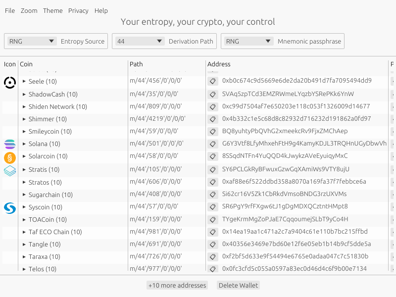
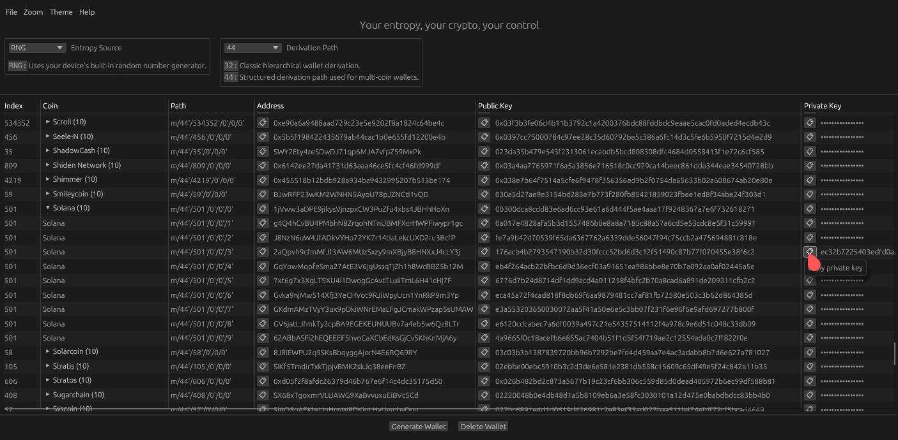
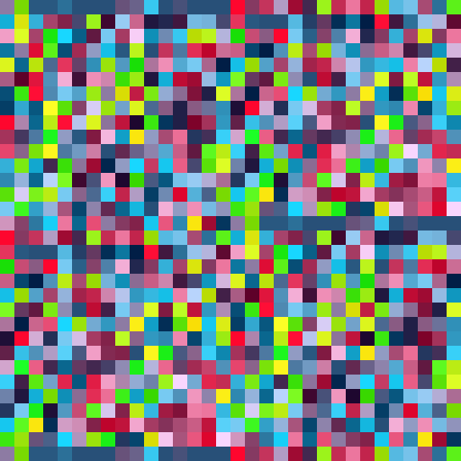

# eQ

## Disclaimer

> Read the [DISCLAIMER](./DISCLAIMER.md) file.


## Info

```
 ▄▄▄▄▄▄▄▄▄▄▄  ▄▄▄▄▄▄▄▄▄▄▄ 
▐░░░░░░░░░░░▌▐░░░░░░░░░░░▌
▐░█▀▀▀▀▀▀▀▀▀ ▐░█▀▀▀▀▀▀▀█░▌
▐░▌          ▐░▌       ▐░▌
▐░█▄▄▄▄▄▄▄▄▄ ▐░▌       ▐░▌
▐░░░░░░░░░░░▌▐░▌       ▐░▌
▐░█▀▀▀▀▀▀▀▀▀ ▐░█▄▄▄▄▄▄▄█░▌
▐░▌          ▐░░░░░░░░░░░▌
▐░█▄▄▄▄▄▄▄▄▄  ▀▀▀▀▀▀█░█▀▀ 
▐░░░░░░░░░░░▌        ▐░▌  
 ▀▀▀▀▀▀▀▀▀▀▀          ▀   
CC-BY-NC-ND-4.0
Control Owl [2023-2026]
```

**eQ** is a **high-performance cryptographic key generator** built with **Rust** and **egui**, designed for **speed**, **security**, and **minimal** system dependencies. It supports generating secure addresses for **285 coins**. Check the [coin list](./Coins.md)

This is the second generation of our key generator, following [QR2M](https://github.com/control-owl/QR2M).

- **Focus:** Speed, security, and simplicity
- **Cross-platform:** Windows, Linux, macOS
- **Security-first design:** Zeroization, AES-256-GCM encryption, Shamir's Secret Sharing

Wallets can be stored as **AES-256-GCM encrypted SVG images** and optionally **split into multiple shares using Shamir's Secret Sharing** for enhanced security.


## Table of Contents

- [Disclaimer](#disclaimer)
- [Info](#info)
- [License](#license)
- [Project Status](#project-status)
- [Features](#features)
- [Installation](#installation)
- [Screenshots](#screenshots)
- [Third-Party Libraries](#third-party-libraries)


## License

This project is licensed under a **Creative Commons Attribution Non Commercial No Derivatives 4.0 International license**. 

See the [LICENSE]((./LICENSE.txt)) file or the official [deed](https://creativecommons.org/licenses/by-nc-nd/4.0/deed.en).


## Project status

| **Security Status**  |
| -------------------- |
| [](https://github.com/control-owl/eQ/actions/workflows/verify-gpg-signature.yml) |
| [](https://github.com/control-owl/eQ/actions/workflows/github-code-scanning/codeql) |

| **Build Status**     |
| -------------------- |
| [](https://github.com/control-owl/eQ/actions/workflows/release-linux-gnu.yml) |
| [](https://github.com/control-owl/eQ/actions/workflows/release-macos-aarch64.yml) |
| [](https://github.com/control-owl/eQ/actions/workflows/release-windows_x86_64.yml) |


## Features

- Generate keys for **285** [coins](./Coins.md) in one click
- **Ultra-fast performance** powered by Rust
- **Minimalistic UI** built with egui
- **Cross-platform** support: Windows, Linux, macOS
- Supports **secp256k1** and **ed25519** elliptic curve coins
- [Zeroizing](https://en.wikipedia.org/wiki/Zeroisation) of all secrets
- Wallet saved as **AES_256_GCM encrypted SVG image**
- Optional [Shamir's secret sharing](https://en.wikipedia.org/wiki/Shamir%27s_secret_sharing) for secure wallet splitting


## Installation

### Official Release

1. Download the latest release from [Releases](https://github.com/control-owl/eQ/releases).


### Manual way

#### 1. Clone the Repository

- Download latest stable version

```shell
git clone -b stable --single-branch https://github.com/control-owl/eQ.git
cd eQ
```

#### 2. Build the Project

```shell
cargo build --release
```

#### 3. Run the Application

```shell
cargo run --release
```


## Screenshots

### Light theme


### Dark theme


### Sample wallet file



## Third-Party Libraries

This project uses the following crates:

- [base32](https://docs.rs/base32)
- [base64](https://docs.rs/base64)
- [bech32](https://docs.rs/bech32)
- [bs58](https://docs.rs/bs58)
- [curve25519-dalek](https://docs.rs/curve25519_dalek)
- [ed25519-dalek](https://docs.rs/ed25519_dalek)
- [egui](https://docs.rs/egui)
- [eframe](https://docs.rs/eframe)
- [egui_extras](https://docs.rs/egui_extras)
- [getrandom](https://docs.rs/getrandom)
- [hex](https://docs.rs/hex)
- [include_dir](https://docs.rs/include_dir)
- [num-bigint](https://docs.rs/num_bigint)
- [rfd](https://docs.rs/rfd)
- [ring](https://docs.rs/ring)
- [ripemd](https://docs.rs/ripemd)
- [secp256k1](https://docs.rs/secp256k1)
- [serde](https://docs.rs/serde)
- [serde_json](https://docs.rs/serde_json)
- [sha2](https://docs.rs/sha2)
- [sha3](https://docs.rs/sha3)
- [shamir_share](https://docs.rs/shamir_share)
- [svg](https://docs.rs/svg)
- [sysinfo](https://docs.rs/sysinfo)
- [tiny-keccak](https://docs.rs/tiny_keccak)
- [ureq](https://docs.rs/ureq)
- [winres](https://docs.rs/winres)
- [zeroize](https://docs.rs/zeroize)
