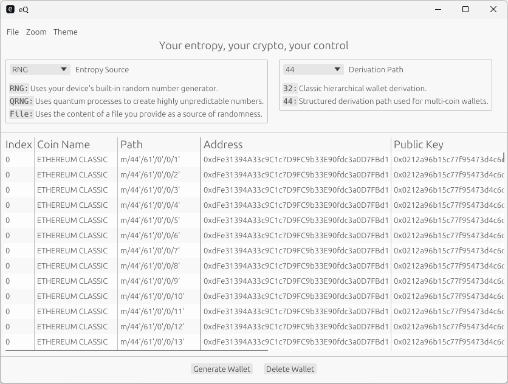
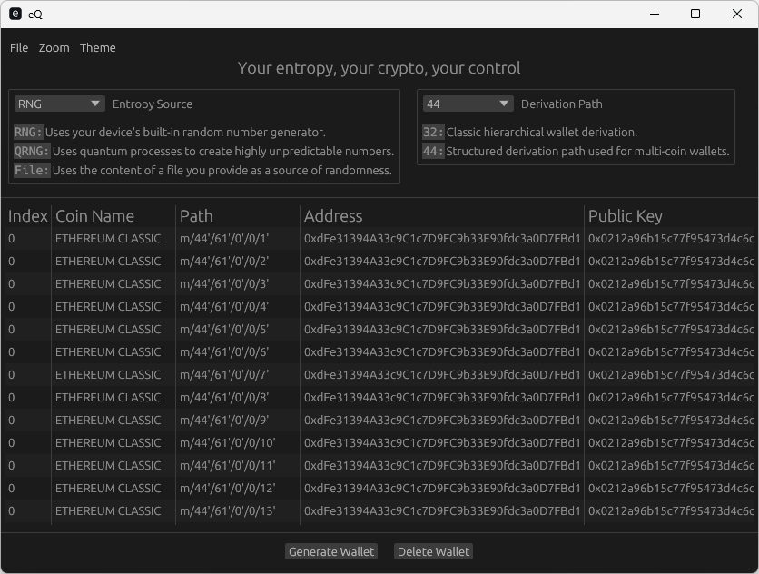

# eQ

## Early beta

Trying to port [QR2M](https://www.github.com/control-owl/QR2M) from [GTK4](https://www.gtk.org/) to [egui](https://docs.rs/egui/latest/egui/)


## Basics

```
 ▄▄▄▄▄▄▄▄▄▄▄  ▄▄▄▄▄▄▄▄▄▄▄ 
▐░░░░░░░░░░░▌▐░░░░░░░░░░░▌
▐░█▀▀▀▀▀▀▀▀▀ ▐░█▀▀▀▀▀▀▀█░▌
▐░▌          ▐░▌       ▐░▌
▐░█▄▄▄▄▄▄▄▄▄ ▐░▌       ▐░▌
▐░░░░░░░░░░░▌▐░▌       ▐░▌
▐░█▀▀▀▀▀▀▀▀▀ ▐░█▄▄▄▄▄▄▄█░▌
▐░▌          ▐░░░░░░░░░░░▌
▐░█▄▄▄▄▄▄▄▄▄  ▀▀▀▀▀▀█░█▀▀ 
▐░░░░░░░░░░░▌        ▐░▌  
 ▀▀▀▀▀▀▀▀▀▀▀          ▀   
CC-BY-NC-ND-4.0
Control Owl [2025]
```

**eQ** is a **cryptographic key generator** built with **Rust** and **egui**. It supports generating secure addresses for +250 crypto coins.

This is second generation of key generator, with [QR2M](https://github.com/control-owl/QR2M) as a first one.

Now, focus is on speed and no system dependencies.


## Table of Contents

- [License](#license)
- [Project Status](#project-status)
- [Features](#features)
- [Installation](#installation)
- [Screenshots](#screenshots)
- [Third-Party Libraries](#third-party-libraries)


## License

This project is licensed under a **Creative Commons Attribution Non Commercial No Derivatives 4.0 International license**. 
Check the [deed](https://creativecommons.org/licenses/by-nc-nd/4.0/deed.en).


## Project status

| **Security Status**  |
| -------------------- |
| Verify GPG Signature |
| CodeQL               |

| **Build Status**     |
| -------------------- |
| Linux x86_64 GNU     |
| macOS aarch64 Darwin |


## Features

- Generate crypto keys in a click for +250 coins
- Extreme fast
- Minimal look


## Installation

1. git clone
2. cargo


## Screenshots

### Light theme


### Dark theme



## Third-Party Libraries

- [egui](https://docs.rs/egui)
- [sysinfo](https://docs.rs/sysinfo)
- [getrandom](https://docs.rs/getrandom)
- [sha2](https://docs.rs/sha2)
- [sha3](https://docs.rs/sha3)
- [ring](https://docs.rs/ring)
- [hex](https://docs.rs/hex)
- [bs58](https://docs.rs/bs58)
- [secp256k1](https://docs.rs/secp256k1)
- [ripemd](https://docs.rs/ripemd)
- [num-bigint](https://docs.rs/num-bigint)
- [include_dir](https://docs.rs/include_dir)
- [winres](https://docs.rs/winres)